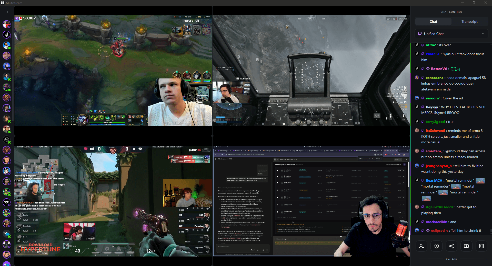

<div align="center">
  <h1 align="center">Multistream</h1>

  <p align="center">Twitch, Kick, and YouTube. Side by side. No browser required.</p>

  <p align="center"><strong>Available for Windows, Linux and macOS</strong></p>

  <p align="center">
    <a href="https://usemultistream.vercel.app/">Website</a>
    ·
    <a href="https://github.com/ilanzgx/multistream/releases">Download</a>
    ·
    <a href="https://ko-fi.com/ilanfonseca">Buy me a coffee</a>
    ·
    <a href="https://github.com/ilanzgx/multistream/issues">Report Bug</a>
    ·
    <a href="https://github.com/ilanzgx/multistream/issues">Request Feature</a>
  </p>
  <br />

  
  <br />
  <br />
</div>

Most multistream setups are just browser tabs. Multistream is a desktop app built with [Tauri](https://v2.tauri.app/), [Rust](https://www.rust-lang.org/), and [Vue 3](https://vuejs.org/): Twitch, Kick, and YouTube side by side in one window, using less memory than a single Chrome tab, with no trackers or background processes.

## Why Multistream?

| Feature | Multistream | Browser tabs / Web tools |
| :--- | :--- | :--- |
| **Memory usage** | Low (Tauri + Rust) | High (separate Chromium processes per tab) |
| **Chat** | Unified Twitch & Kick feed | Split across separate tabs |
| **Privacy** | 100% local, zero tracking | Third-party scripts and telemetry |
| **Stream recording** | Direct recording to MP4 via Streamlink | Requires external tools or extensions |
| **Live transcription** | Offline Whisper.cpp on CPU | Not supported natively |

## Features

- **Privacy by design**: Everything runs locally. No middleman servers, no data collection.
- **Account Authentication & Unified Chat**: Log in to your Twitch and Kick accounts securely and read both chats together in one place, directly in the app. Free, no subscription. Supports 7TV, BTTV, and platform emotes.
- **Direct from the source**: Streams load from the official players, so your views count and quality is exactly the same as on the platform itself.
- **Lightweight**: Built with [Tauri](https://tauri.app/) and [Rust](https://www.rust-lang.org/), so memory usage is a fraction of what any browser-based alternative would use.
- **Local stream recording**: Record streams directly from the source using [Streamlink](https://streamlink.github.io/). Recordings are processed natively without heavy sidecars, keeping the app extremely lightweight, and are automatically remuxed to MP4 when finished.
- **Available in 10 languages**: English, Portuguese, Spanish, German, Russian, Chinese, French, Turkish, Hindi, and Indonesian. _(Note: Languages other than English and Portuguese were AI-translated. Native speakers are highly welcome to open a PR to improve them!)_
- **Cross-platform**: Works on Windows, macOS, and Linux.
- **Local AI transcription**: _(Windows only)_ Real-time transcription powered by [Whisper.cpp](https://github.com/ggerganov/whisper.cpp), running fully offline on your CPU. Useful for streams in languages you don't speak. No API keys, no costs, no audio ever leaves your machine.

## Downloads

| Platform | Download |
| :--- | :--- |
| **Windows (x64)** | [Installer (.exe)](https://github.com/ilanzgx/multistream/releases/latest/download/Multistream-windows-x64-setup.exe) · [MSI (.msi)](https://github.com/ilanzgx/multistream/releases/latest/download/Multistream-windows-x64.msi) |
| **macOS (Apple Silicon)** | [DMG (.dmg)](https://github.com/ilanzgx/multistream/releases/latest/download/Multistream-macos-arm64.dmg) |
| **macOS (Intel)** | [DMG (.dmg)](https://github.com/ilanzgx/multistream/releases/latest/download/Multistream-macos-x64.dmg) |
| **macOS (Homebrew)** | `brew install --cask ilanzgx/multistream/multistream` |
| **Linux (x64)** | [AppImage (.AppImage)](https://github.com/ilanzgx/multistream/releases/latest/download/Multistream-linux-x64.AppImage) · [Debian (.deb)](https://github.com/ilanzgx/multistream/releases/latest/download/Multistream-linux-x64.deb) |

You can also check previous versions and signatures on the [Releases page](https://github.com/ilanzgx/multistream/releases).

## Important for macOS Users

As a free, open-source project, Multistream is distributed without a paid Apple Developer certificate. This causes macOS Gatekeeper to flag the application as "damaged" by default.

If you see the error _"Multistream is damaged and can't be opened"_, you have two options:

**1. Install via Homebrew (Recommended):**

```sh
brew install --cask ilanzgx/multistream/multistream
```

**2. Fix manually after downloading the DMG:**

Move `Multistream.app` to your `/Applications` folder, then run:

```sh
xattr -dr com.apple.quarantine /Applications/Multistream.app
```

## Keyboard Shortcuts

You can navigate the app quickly using these global hotkeys (they even work when you are interacting with a stream iframe):

| Shortcut                    | Action                                                    |
| :-------------------------- | :-------------------------------------------------------- |
| <kbd>1</kbd> - <kbd>9</kbd> | Switch active chat tab to the corresponding stream number |
| <kbd>D</kbd>                | Open the "Add Stream" dialog                              |
| <kbd>S</kbd>                | Take a screenshot of the focused stream                   |

## Local Development

If you want to compile the app yourself or contribute to the project, follow the instructions below to set up your local development environment. See [`CONTRIBUTING.md`](./CONTRIBUTING.md) for full development workflows, translation guides, and testing commands.

### Prerequisites

- [Bun](https://bun.sh/)
- [Rust](https://www.rust-lang.org/)

### Setup

1. Clone the repository
   ```sh
   git clone https://github.com/ilanzgx/multistream.git
   ```
2. Install dependencies
   ```sh
   bun install
   ```
3. Set up environment variables (required for Kick chat login)
   Create a `.env` file inside `apps/desktop/src-tauri/` and add your Kick app credentials:
   ```env
   KICK_CLIENT_ID=your_client_id
   KICK_CLIENT_SECRET=your_client_secret
   TWITCH_CLIENT_ID=your_client_id
   ```
4. Start in development mode
   ```sh
   bun run desktop:tauri:dev
   ```

## Legal Notice

Multistream is an independent open-source project and is not affiliated with, endorsed by, or connected to Twitch, Kick, YouTube, Amazon, or Google. 

All trademarks, logos, and brand names belong to their respective owners.

## License

Distributed under the GPL-3.0 License. See [`LICENSE`](./LICENSE) for more information.
